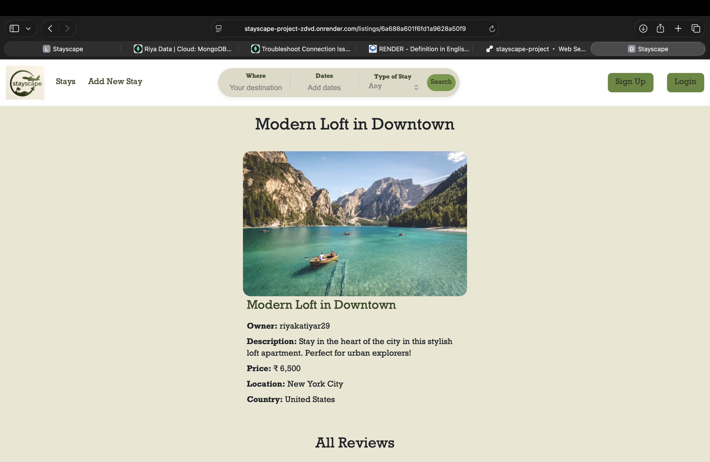
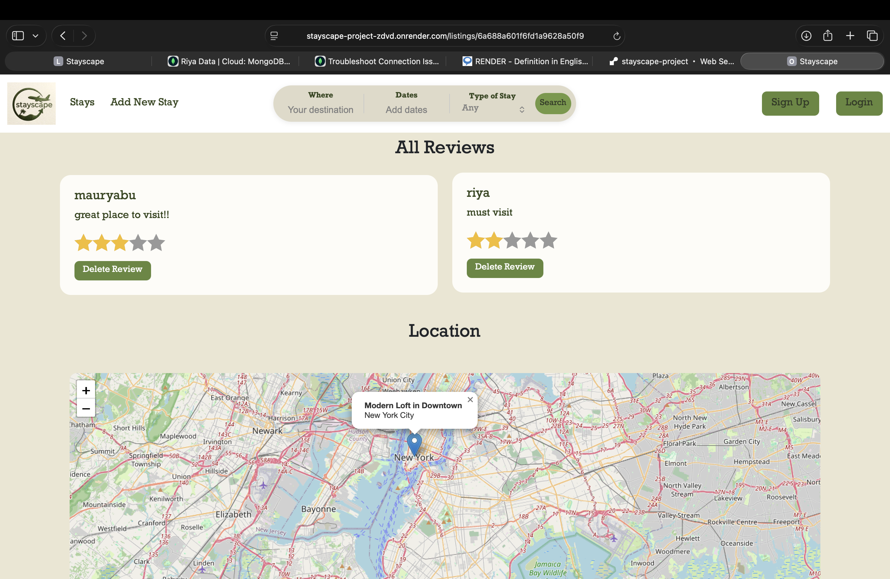

# StayScape

StayScape is a full-stack accommodation booking platform that allows users to browse, create, edit, and review property listings. It provides a responsive user experience across desktop and mobile devices with secure authentication, cloud image storage, and interactive maps.

## Live Demo

🔗 https://stayscape-project-zdvd.onrender.com/listings


## Screenshots

### Home Page


### Your Stay Details Page



### Reviews/Location Page



### Browse by Category


## Features

- User authentication and authorization
- Create, edit, and delete property listings
- Upload listing images using Cloudinary
- Interactive maps with Leaflet and OpenStreetMap
- Geolocation using Nominatim API
- Review and rating system
- Responsive design for desktop and mobile
- Flash messages and error handling

## Tech Stack

### Frontend
- HTML
- CSS
- Bootstrap
- EJS
- JavaScript

### Backend
- Node.js
- Express.js

### Database
- MongoDB
- Mongoose

### Authentication
- Passport.js

### Image Storage
- Cloudinary
- Multer

### Maps & Geocoding
- Leaflet
- OpenStreetMap
- Nominatim API

### Deployment
- Render

##  Project Structure

```
StayScape/
│── models/
│── routes/
│── controllers/
│── middleware.js
│── views/
│── public/
│── app.js
│── package.json
```

##  Installation

Clone the repository

```bash
git clone https://github.com/yourusername/stayscape-project.git
```

Navigate to the project

```bash
cd stayscape-project
```

Install dependencies

```bash
npm install
```

Create a `.env` file and add:

```env
ATLASDB_URL=
SECRET=
CLOUD_NAME=
CLOUD_API_KEY=
CLOUD_API_SECRET=
```

Start the application

```bash
npm start
```

Visit:

```
http://localhost:8080
```

## What I Learned

Through this project, I gained hands-on experience with:

- Building RESTful web applications
- Authentication using Passport.js
- MongoDB data modeling with Mongoose
- Image uploads with Cloudinary and Multer
- Maps and geolocation integration
- Responsive UI design using Bootstrap
- Deploying full-stack applications on Render
- Managing environment variables in production

##  Contributing

Contributions and suggestions are welcome. Feel free to fork the repository and submit a pull request.

## License

This project is for learning and educational purposes.